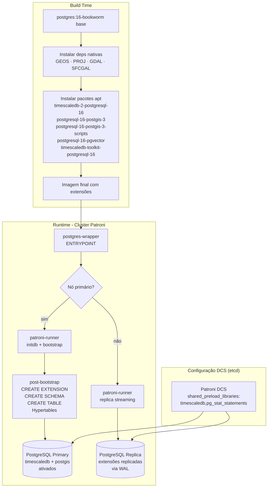
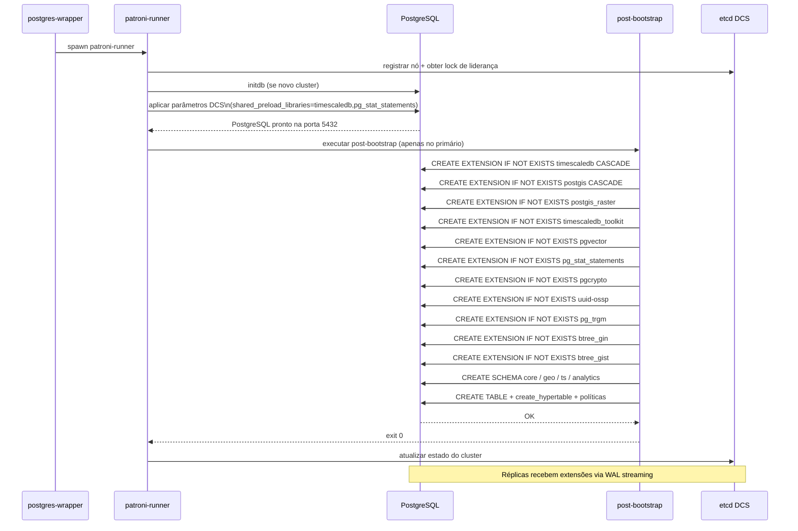

# Design Document: TimescaleDB + PostGIS Extensions

## Overview

Integrar TimescaleDB 2.x e PostGIS 3.x (com todas as dependências nativas: GEOS, PROJ, GDAL, SFCGAL) ao container PostgreSQL existente que roda com Patroni HA, garantindo que as extensões sejam carregadas corretamente em todos os nós do cluster (primário e réplicas) e que o `shared_preload_libraries` seja configurado via Patroni DCS para propagação automática.

O projeto já possui arquivos parciais (`docker/db/Dockerfile`, `docker/db/init/00-init.sql`, `docker/db/init-extensions.sql`, `docker/db/init/01-tuning.sql`) que precisam ser integrados ao fluxo principal do container `postgres-patroni`, que é o container de produção com Patroni HA.

---

## Arquitetura



---

## Fluxo de Sequência — Bootstrap com Extensões



---

## Componentes e Interfaces

### Componente 1: Dockerfile (`postgres-patroni/Dockerfile`)

**Propósito**: Construir a imagem de produção com PostgreSQL + Patroni + extensões nativas.

**Responsabilidades**:
- Adicionar repositório packagecloud do TimescaleDB
- Instalar dependências nativas do PostGIS (GEOS, PROJ, GDAL, SFCGAL) via apt
- Instalar pacotes PostgreSQL das extensões
- Manter compatibilidade com o build multi-stage existente (rust-builder → rust-binaries → ha)

**Interface de build**:
```dockerfile
# Build args existentes mantidos
ARG POSTGRES_VERSION=16

# Novos pacotes no stage "ha"
RUN apt-get install -y \
    timescaledb-2-postgresql-${POSTGRES_VERSION} \
    postgresql-${POSTGRES_VERSION}-postgis-3 \
    postgresql-${POSTGRES_VERSION}-postgis-3-scripts \
    postgresql-${POSTGRES_VERSION}-pgvector \
    timescaledb-toolkit-postgresql-${POSTGRES_VERSION}
```

**Dependências nativas do PostGIS instaladas transitivamente via apt**:
- `libgeos-dev` — geometria vetorial
- `libproj-dev` — projeções cartográficas
- `libgdal-dev` — raster e formatos geoespaciais
- `libsfcgal-dev` — operações 3D (ST_3DIntersects, etc.)

---

### Componente 2: Patroni YAML (`postgres-patroni/src/patroni/yaml.rs`)

**Propósito**: Garantir que `timescaledb` esteja em `shared_preload_libraries` no DCS, propagando para todos os nós automaticamente.

**Interface atual** (trecho relevante):
```rust
parameters:
  shared_preload_libraries: pg_stat_statements
```

**Interface após a mudança**:
```rust
parameters:
  shared_preload_libraries: "timescaledb,pg_stat_statements"
  timescaledb.max_background_workers: 16
```

**Responsabilidades**:
- `timescaledb` DEVE ser o primeiro na lista (requisito do TimescaleDB)
- Parâmetros de tuning do TimescaleDB propagados via DCS para todos os nós

---

### Componente 3: Post-Bootstrap (`postgres-patroni/src/bin/post-bootstrap`)

**Propósito**: Executar DDL de extensões, schemas e tabelas no nó primário após o bootstrap do Patroni.

**Interface**:
```rust
pub fn run_extensions(creds: &Credentials) -> Result<()>
pub fn run_schemas(creds: &Credentials) -> Result<()>
pub fn run_hypertables(creds: &Credentials) -> Result<()>
```

**Responsabilidades**:
- Criar extensões na ordem correta (timescaledb antes de postgis para evitar conflitos de preload)
- Criar schemas: `core`, `geo`, `ts`, `analytics`
- Criar tabelas base e hypertables
- Configurar compressão e políticas de continuous aggregate
- Idempotente: usar `IF NOT EXISTS` em todos os DDLs

---

### Componente 4: Scripts SQL de Inicialização (`docker/db/init/`)

**Propósito**: Referência e documentação do schema — estes scripts são usados pelo `docker/db/Dockerfile` (modo standalone, sem Patroni). O modo HA usa o post-bootstrap Rust.

**Arquivos**:
- `00-init.sql` — extensões, schemas, tabelas, hypertables, compressão, continuous aggregates
- `01-tuning.sql` — `ALTER SYSTEM SET` para parâmetros de performance
- `init-extensions.sql` — lista completa de extensões (referência)

---

## Modelos de Dados

### Extensões Instaladas

| Extensão | Pacote apt | Propósito |
|---|---|---|
| `timescaledb` | `timescaledb-2-postgresql-16` | Hypertables, compressão, continuous aggregates |
| `timescaledb_toolkit` | `timescaledb-toolkit-postgresql-16` | Funções analíticas avançadas |
| `postgis` | `postgresql-16-postgis-3` | Tipos geométricos, índices GIST |
| `postgis_raster` | `postgresql-16-postgis-3-scripts` | Suporte a dados raster |
| `pgvector` | `postgresql-16-pgvector` | Embeddings vetoriais |
| `pg_stat_statements` | built-in | Observabilidade de queries |
| `pgcrypto` | built-in | Funções criptográficas |
| `uuid-ossp` | built-in | Geração de UUIDs |
| `pg_trgm` | built-in | Busca por similaridade textual |
| `btree_gin` | built-in | Índices GIN para tipos btree |
| `btree_gist` | built-in | Índices GiST para tipos btree |

### Schema de Dados

```sql
-- core: entidades de negócio
core.field (id UUID PK, name TEXT)

-- geo: dados geoespaciais
geo.field_boundary (
  field_id UUID PK FK→core.field,
  geom GEOMETRY(MULTIPOLYGON, 4326)
  INDEX GIST(geom)
)

-- ts: séries temporais (hypertable)
ts.sensor_data (
  time TIMESTAMPTZ NOT NULL,  -- dimensão de particionamento
  field_id UUID NOT NULL,
  sensor_type TEXT,
  value DOUBLE PRECISION,
  metadata JSONB
  chunk_time_interval = 6h
  compress_segmentby = field_id
  compression_policy = 3 days
)

-- analytics: continuous aggregates
analytics.sensor_hourly (
  field_id UUID,
  bucket TIMESTAMPTZ,  -- time_bucket('1 hour', time)
  avg DOUBLE PRECISION,
  max DOUBLE PRECISION,
  min DOUBLE PRECISION
  refresh: start=-3d, end=-10min, interval=5min
)
```

---

## Tratamento de Erros

### Cenário 1: TimescaleDB ausente do `shared_preload_libraries`

**Condição**: `CREATE EXTENSION timescaledb` executado sem preload  
**Resposta**: PostgreSQL retorna erro `FATAL: timescaledb must be loaded via shared_preload_libraries`  
**Mitigação**: `timescaledb` configurado no DCS antes do primeiro start do PostgreSQL; o Patroni aplica o parâmetro via `ALTER SYSTEM` + reload

### Cenário 2: Falha no post-bootstrap

**Condição**: `post-bootstrap` retorna exit code != 0  
**Resposta**: Patroni marca o bootstrap como falho e reinicia o processo  
**Mitigação**: Todos os DDLs usam `IF NOT EXISTS`; o script é idempotente e pode ser re-executado com segurança

### Cenário 3: Réplica sem extensões

**Condição**: Réplica inicia antes do primário criar as extensões  
**Resposta**: Extensões são replicadas via WAL streaming automaticamente pelo PostgreSQL  
**Mitigação**: Réplicas não executam `post-bootstrap`; recebem o estado via replicação física

### Cenário 4: Versão incompatível de pacote

**Condição**: `timescaledb-2-postgresql-16` não disponível para `POSTGRES_VERSION=17+`  
**Resposta**: Build falha com erro apt  
**Mitigação**: Parametrizar versão do TimescaleDB como `ARG TIMESCALEDB_VERSION` no Dockerfile; documentar matriz de compatibilidade

---

## Estratégia de Testes

### Testes de Unidade

- Verificar que `generate_patroni_config()` inclui `timescaledb` em `shared_preload_libraries`
- Verificar que `timescaledb` é o primeiro item na lista de preload
- Verificar que `timescaledb.max_background_workers` está presente nos parâmetros

### Testes de Propriedade

**Biblioteca**: `proptest` (Rust)

- Para qualquer configuração válida de `Config`, `generate_patroni_config()` sempre produz YAML com `timescaledb` no início de `shared_preload_libraries`
- Para qualquer sequência de execução do post-bootstrap, o resultado é idempotente (executar N vezes = executar 1 vez)

### Testes de Integração

- Build da imagem Docker completa sem erros
- Container sobe e `pg_isready` retorna OK
- `SELECT extname FROM pg_extension` retorna todas as extensões esperadas
- `SELECT * FROM timescaledb_information.hypertables` retorna `ts.sensor_data`
- `SELECT ST_AsText(ST_Point(0,0))` retorna resultado válido (PostGIS funcional)
- Cluster Patroni com 3 nós: réplicas recebem extensões via WAL

---

## Considerações de Performance

- `timescaledb.max_background_workers = 16` — workers para compressão e continuous aggregates
- `max_worker_processes = 32` — necessário para suportar workers do TimescaleDB + paralelismo do PostgreSQL
- `work_mem = 64MB` — queries geo + agregações temporais são memory-intensive
- `effective_io_concurrency = 256` — otimizado para SSDs NVMe com scans GIS
- Chunk interval de 6h em `ts.sensor_data` — balanceia tamanho de chunk vs. overhead de metadados para ingestão de alta frequência
- Compressão ativada após 3 dias — reduz footprint em ~90% para dados históricos

---

## Considerações de Segurança

- Extensões criadas apenas no banco de dados da aplicação (`app_db`), não em `postgres` ou `template1`
- `postgis_raster` requer atenção: pode expor funções de leitura de arquivos do filesystem — garantir que o usuário da aplicação não tenha `SUPERUSER`
- Repositório packagecloud do TimescaleDB autenticado via GPG key — verificar fingerprint no Dockerfile
- `timescaledb_toolkit` inclui funções de estatística avançada — sem implicações de segurança adicionais

---

## Dependências

| Dependência | Versão | Origem |
|---|---|---|
| `timescaledb-2-postgresql-16` | 2.x latest | packagecloud.io/timescale |
| `postgresql-16-postgis-3` | 3.x latest | apt.postgresql.org |
| `postgresql-16-postgis-3-scripts` | 3.x latest | apt.postgresql.org |
| `postgresql-16-pgvector` | latest | apt.postgresql.org |
| `timescaledb-toolkit-postgresql-16` | latest | packagecloud.io/timescale |
| GEOS | transitivo via postgis | apt |
| PROJ | transitivo via postgis | apt |
| GDAL | transitivo via postgis | apt |
| SFCGAL | transitivo via postgis | apt |

---

## Especificações Formais (Low-Level)

### Algoritmo: Ordem de Criação de Extensões

```pascal
PROCEDURE create_extensions(superuser, app_db)
  INPUT: superuser (String), app_db (String)
  OUTPUT: Result<(), Error>

  PRECONDITION:
    - PostgreSQL está rodando e aceitando conexões
    - timescaledb está em shared_preload_libraries
    - superuser tem privilégios de SUPERUSER

  SEQUENCE
    -- timescaledb DEVE ser criado antes de postgis
    -- pois ambos registram hooks no preload
    run_psql_in_db(superuser, app_db,
      "CREATE EXTENSION IF NOT EXISTS timescaledb CASCADE")

    run_psql_in_db(superuser, app_db,
      "CREATE EXTENSION IF NOT EXISTS postgis CASCADE")

    run_psql_in_db(superuser, app_db,
      "CREATE EXTENSION IF NOT EXISTS postgis_raster")

    -- toolkit depende de timescaledb já instalado
    run_psql_in_db(superuser, app_db,
      "CREATE EXTENSION IF NOT EXISTS timescaledb_toolkit")

    FOR each ext IN [pgvector, pg_stat_statements, pgcrypto,
                     uuid-ossp, pg_trgm, btree_gin, btree_gist] DO
      run_psql_in_db(superuser, app_db,
        "CREATE EXTENSION IF NOT EXISTS " + ext)
    END FOR

    RETURN Ok(())
  END SEQUENCE

  POSTCONDITION:
    - SELECT count(*) FROM pg_extension WHERE extname IN (...) = 11
    - Operação é idempotente: re-executar não causa erro
END PROCEDURE
```

### Algoritmo: Configuração do shared_preload_libraries no DCS

```pascal
FUNCTION build_shared_preload_libraries(extra_libs: List<String>) -> String
  INPUT: extra_libs — lista de bibliotecas adicionais
  OUTPUT: String com lista ordenada para shared_preload_libraries

  PRECONDITION:
    - timescaledb NÃO está em extra_libs (será inserido pelo algoritmo)

  SEQUENCE
    -- timescaledb DEVE ser o primeiro (requisito do projeto)
    result ← ["timescaledb"]

    FOR each lib IN extra_libs DO
      IF lib ≠ "timescaledb" THEN
        result.append(lib)
      END IF
    END FOR

    RETURN join(result, ",")
  END SEQUENCE

  POSTCONDITION:
    - result.starts_with("timescaledb")
    - "timescaledb" aparece exatamente uma vez em result
    - Todos os itens de extra_libs estão em result (exceto duplicatas de timescaledb)
END FUNCTION
```

### Algoritmo: Criação de Hypertable com Políticas

```pascal
PROCEDURE setup_hypertable(superuser, app_db)
  INPUT: superuser (String), app_db (String)
  OUTPUT: Result<(), Error>

  PRECONDITION:
    - Extensão timescaledb já criada em app_db
    - Schema ts já existe

  SEQUENCE
    run_psql_in_db(superuser, app_db, "
      CREATE TABLE IF NOT EXISTS ts.sensor_data (
        time        TIMESTAMPTZ NOT NULL,
        field_id    UUID NOT NULL,
        sensor_type TEXT,
        value       DOUBLE PRECISION,
        metadata    JSONB
      )
    ")

    -- Idempotente: create_hypertable retorna erro se já é hypertable
    -- usar IF NOT EXISTS equivalente via verificação prévia
    run_psql_in_db(superuser, app_db, "
      SELECT CASE
        WHEN NOT EXISTS (
          SELECT 1 FROM timescaledb_information.hypertables
          WHERE hypertable_schema = 'ts'
          AND hypertable_name = 'sensor_data'
        )
        THEN create_hypertable(
          'ts.sensor_data', 'time',
          chunk_time_interval => INTERVAL '6 hours'
        )::text
        ELSE 'already exists'
      END
    ")

    -- Compressão (idempotente via IF NOT EXISTS implícito do ALTER TABLE SET)
    run_psql_in_db(superuser, app_db, "
      ALTER TABLE ts.sensor_data SET (
        timescaledb.compress,
        timescaledb.compress_segmentby = 'field_id'
      )
    ")

    run_psql_in_db(superuser, app_db, "
      SELECT add_compression_policy(
        'ts.sensor_data', INTERVAL '3 days',
        if_not_exists => true
      )
    ")

    RETURN Ok(())
  END SEQUENCE

  POSTCONDITION:
    - ts.sensor_data é uma hypertable com chunk_time_interval = 6h
    - Política de compressão ativa para dados > 3 dias
    - Operação é idempotente
END PROCEDURE
```

### Especificação Formal: Invariantes do Cluster HA

```pascal
INVARIANT cluster_extensions_consistency
  -- Em qualquer estado estável do cluster Patroni:
  FOR each node IN cluster.nodes DO
    IF node.role = PRIMARY THEN
      ASSERT "timescaledb" IN node.shared_preload_libraries
      ASSERT "timescaledb" = first(node.shared_preload_libraries)
      ASSERT count(pg_extension WHERE extname = "timescaledb") = 1
      ASSERT count(pg_extension WHERE extname = "postgis") = 1
    END IF

    IF node.role = REPLICA THEN
      -- Réplicas recebem extensões via WAL, não via DDL direto
      ASSERT node.pg_extension = primary.pg_extension
      ASSERT "timescaledb" IN node.shared_preload_libraries
    END IF
  END FOR
END INVARIANT
```

### Função: Verificação de Saúde das Extensões

```pascal
FUNCTION check_extensions_health(conn) -> HealthStatus
  INPUT: conn — conexão PostgreSQL
  OUTPUT: HealthStatus { ok: bool, missing: List<String> }

  PRECONDITION:
    - conn é uma conexão válida ao banco app_db

  SEQUENCE
    required ← [
      "timescaledb", "postgis", "postgis_raster",
      "timescaledb_toolkit", "pgvector", "pg_stat_statements",
      "pgcrypto", "uuid-ossp", "pg_trgm", "btree_gin", "btree_gist"
    ]

    installed ← SELECT extname FROM pg_extension

    missing ← required - installed

    IF missing IS EMPTY THEN
      RETURN { ok: true, missing: [] }
    ELSE
      RETURN { ok: false, missing: missing }
    END IF
  END SEQUENCE

  POSTCONDITION:
    - result.ok = true IFF result.missing IS EMPTY
    - result.missing ⊆ required
END FUNCTION
```

---

## Propriedades de Correção

*Uma propriedade é uma característica ou comportamento que deve ser verdadeiro em todas as execuções válidas do sistema — essencialmente, uma declaração formal sobre o que o sistema deve fazer. Propriedades servem como ponte entre especificações legíveis por humanos e garantias de correção verificáveis por máquina.*

### Property 1: Idempotência do post-bootstrap

*Para qualquer* estado inicial do banco de dados, executar o post-bootstrap N vezes (N ≥ 1) produz o mesmo estado final que executar 1 vez — sem erros em re-execuções, pois todos os DDLs usam `IF NOT EXISTS` ou verificação prévia equivalente.

**Validates: Requirements 3.6, 4.7**

### Property 2: Ordem de preload no YAML do Patroni

*Para qualquer* valor válido de `Config`, `generate_patroni_config(config)` sempre produz um YAML onde `shared_preload_libraries` começa com `"timescaledb"` e contém `"timescaledb"` exatamente uma vez.

**Validates: Requirements 2.1, 2.2**

### Property 3: Consistência de extensões nas réplicas

*Para qualquer* nó réplica do cluster em estado estável (após convergência do WAL), o catálogo `pg_extension` da réplica é idêntico ao do nó primário.

**Validates: Requirements 6.1, 6.2**

### Property 4: Completude de extensões após bootstrap

*Para qualquer* execução bem-sucedida do post-bootstrap, todas as 11 extensões requeridas (`timescaledb`, `postgis`, `postgis_raster`, `timescaledb_toolkit`, `pgvector`, `pg_stat_statements`, `pgcrypto`, `uuid-ossp`, `pg_trgm`, `btree_gin`, `btree_gist`) estão presentes em `pg_extension`.

**Validates: Requirements 3.5**
